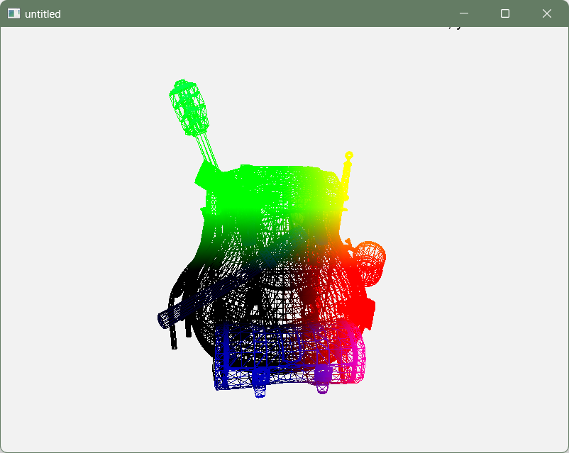
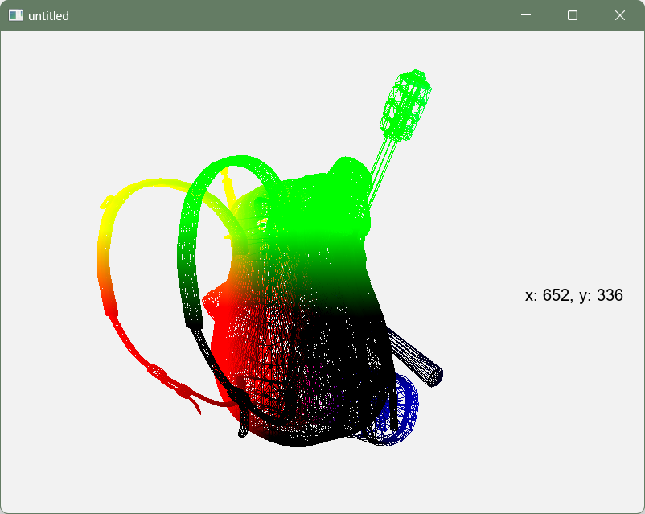

# Wood Block

## About Project

Create wood blocks and decorate each floor.

### Current Result




## Build & Run

### Environment

| Name               | Version   |
|:-------------------|:----------|
| OpenGL             | `4.1`     |
| CMake              | `3.29.2`  |
| Ninja              | `1.12.0`  |
| GCC                | `12.2.0`  |
| Clang              | `18.1.8`  |
| Visual Studio 2022 | `17.8.12` |

- Windows
  - **GCC** with MinGW-W64 (`posix-seh-msvcrt`)
  - **Clang** with LLVM (`windows-msvc`)
  - **Visual Studio 2022** for using vcpkg
- macOS
  - **Apple Clang** with Xcode SDK
- Linux
  - TBA

### Build

```shell
# Clone repository
git clone https://github.com/habijung/untitled.git

# Update submodule
cd untitled
git submodule update --init --recursive

# CMake generate and build
sh build.sh
```

### Run

```shell
# Windows
cd cmake-build/src
./untitled.exe
```

If you can't find some shared libraries in any IDE, run this and build again.

```shell
# Windows
find cmake-build/external -type f -name "*.dll" -exec cp {} "cmake-build/bin" \; 
```

---
**Last Updated:** 24.09.08
